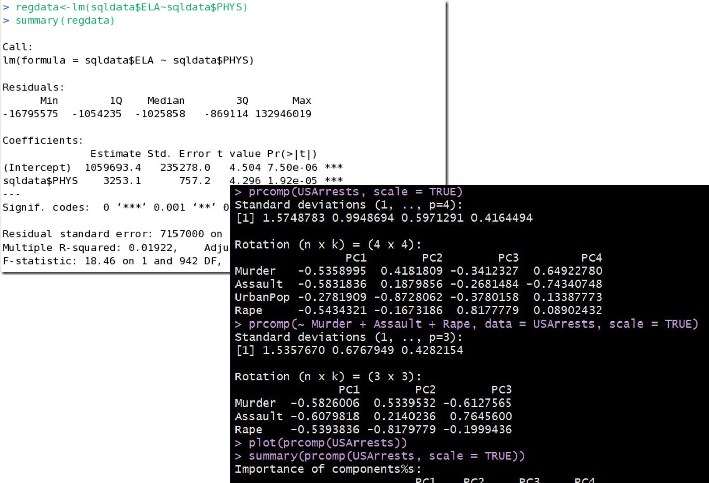
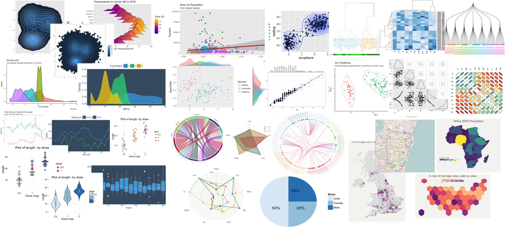
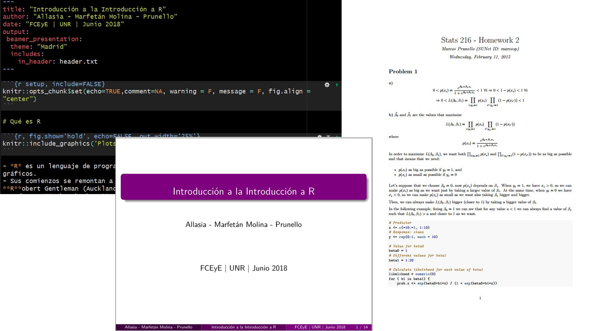
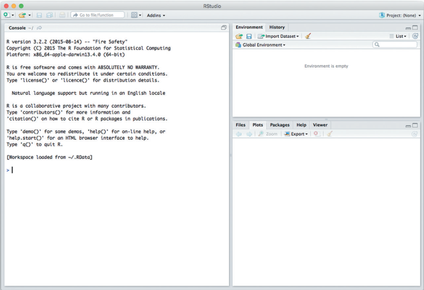

```{r include = FALSE}
knitr::opts_chunk$set(echo = T)
library(viridis)
```

## Cómo es la iniciación a R en la mayoría de los casos


R en Rosario existe para evitarlo o por lo menos que arda menos el impacto.

## Qué es R

- *R* es un lenguaje de programación orientado a la realización de procesos estadísticos y gráficos.
- Sus comienzos se remontan a los años 1993/96 y fue creado por **R**oss Ihaka and **R**obert Gentleman (Auckland University, Nueva Zelanda), basándose en el lenguaje *S* creado por **John Chambers** en 1976 para Bell Labs (parte de AT&T, desarrolladores de *C*).
- A diferencia de *S*, *R* es un software de código abierto ("open source"). Es gratuito.

## Filosofía de R: "hibridez"

- R propone satisfacer dos modalidades de trabajo muy frecuentes para los analistas de datos:

    - **Con una interfaz interactiva, con línea de comandos**: se dispone de una consola, donde se tipea un comando, se da enter y algo sucede. Voy *viendo y haciendo*.
    
    - **Como lenguaje de programación**: para tareas más complejas, escribimos un programa (o "script") y lo ejecutamos en un servidor o desde la terminal de la compu. No se trabaja comando por comando.

- R es un híbrido entre estas dos modalidades.

## Filosofía de R: "hibridez"

- En las palabras de John Chambers (creador de S, base de R):

*"We wanted users to be able to begin in an interactive environment, where they did not consciously think of themselves as programming. Then as their needs became clearer and their sophistication increased, they should be able to slide gradually into programming, when the language and system aspects would become more important."*

- Usuario $\rightarrow$ Programador

## Filosofía de R: "Software Libre"

- *R* se distribuye bajo la licencia para software *GNU GPLv2* que establece las siguientes *libertades*:

    - Libertad de usar el programa con cualquier propósito.
    - Libertad de ver cómo fue hecho, cómo funciona y modificarlo.
    - Libertad de distribuir copias.
    - Libertad de publicar modificaciones y agregados para que estén disponibles para la comunidad.

## Filosofía de R: "comunidad"

- *R* tiene una comunidad de usuarios muy activa, de las más diversas áreas (**es interdisciplinario**).
- Probablemente, casi todo lo que quieras hacer, alguien más ya lo pensó, lo hizo y dejó un hermoso tutorial por ahí para que vos también lo puedas hacer (**es extensible**).
- Cualquier *mensaje de error* que te aparezca, seguro tiene páginas y páginas con gente debatiendo cómo solucionarlo (**es comunitario**).
- Existen numerosas páginas, blogs y foros de ayuda en internet (por ejemplo, StackOverflow).

## Otras características de R

- Se integra con otras herramientas (como Latex) para generar manuscritos y presentaciones que pueden actualizarse automáticamente.
- Disponible en cualquier plataforma de sistema (Windows, OS X, Linux).
- Elimina la necesidad de recurrir a combinaciones de múltiples programas empleados en el proceso del análisis de datos. 
- Provee herramientas gráficas para generar figuras de excelente calidad listas para publicación. 
- Adhiere a los principios de la investigación reproducible.

## Diseño del sistema R

Se divide en dos partes:

- La **base** ("base R System"): se descarga desde [CRAN](https://cran.r-project.org/) ("Comprehensive R Archive Network"). Funciones básicas y fundamentales de R.
    


## Diseño del sistema R

- El **resto**: incluye miles de paquetes con funcionalidad específica que el usuario puede elegir descargar también desde CRAN u otros lugares.
    


## Cosas para hacer en R. Análisis estadísticos

```{r, fig.show='hold', echo=FALSE, out.width='75%'}

```

## Cosas para hacer en R. Gráficos

```{r, fig.show='hold', echo=FALSE, out.width='120%'}

```

## Cosas para hacer en R. Documentos para presentaciones e informes

```{r, fig.show='hold', echo=FALSE, out.width='100%'}

```

## Algunas otras cosas para hacer en R.

- Gráficos interactivos
- Libros y publicaciones online
- Aplicaciones para páginas web
- Material para dar clases
- Etc., etc., etc., ...

## Qué es RStudio

```{r, fig.show='hold', echo=FALSE, fig.align="center", out.width='25%'}
knitr::include_graphics('Plots/RStudioLogo.png')
```

- RStudio es un entorno de desarrollo integrado (IDE) para R.
- Un entorno de desarrollo integrado es una aplicación informática que proporciona servicios integrales para facilitarle al programador el desarrollo de software.

## Qué es RStudio

- permite abrir y editar varios archivos a la vez
- incluye autocompletado y resaltador de código
- permite ejecutar porciones de código con sólo seleccionarlos en el programa
- muestra el workspace (todos los elementos que hemos creado con nuestro programa)
- muestra el historial de sentencias ejecutadas
- integra ayuda y documentación
- integra la gestión de paquetes adicionales
- gestiona proyectos de trabajo
- gestiona gráficos
- se conecta a la línea de comandos de la compu
- y mucho más!

## Conociendo a RStudio

- Cuando se abre RStudio por primera vez se pueden visualizar tres paneles: 

```{r, out.width='60%', fig.show='hold', fig.cap='Captura de pantalla de RStudio', echo=FALSE, fig.align="center"}

```

## Conociendo a RStudio

- La **consola**. Es la ventana que se comunica con el motor de R.
- Arriba a la derecha, el panel con las pestañas:

    - **Environment** (*ambiente*): muestra todas las cosas (*objetos*) que R tiene en la cabeza (*memoria*), como conjuntos de datos, modelos, resultados, etc. 
    - **History** (*historial*): lista todas las instrucciones que R ha corrido.

- Abajo a la derecha: panel con las pestañas **Files**, **Plots**, **Packages**, **Help** y **Viewer**. Tienen lo que sus nombres indican!

## Uso básico de R: como una calculadora

```{r, echo=T}
1 + 2
5 * 3
exp(2)
sqrt(100)
1:20
log(1:20)
```

## Conceptos básicos fundamentales

>- Objetos
>- Funciones
>- Tipos de datos
>- Mensajes con advertencias
>- Mensajes con errores
>- Script de código
>- Uso de comentarios
>- Paquetes
>- Workspace: ls(), rm(), rm(list = ls()), save.image(), load()
>- Working directory: getwd(), setwd(), list.files()

## Otras cuestiones importantes

- La función c()
- Operadores lógicos
- Indexar vectores

```{r}
x <- c(10.4, 5.6, 3.1, 6.4, 21.7)

# Mostrar sólo el primer elemento
x[1]

# Mostrar los primeros tres elementos
x[1:3]

#Mostrar todos los elementos menos el cuarto
x[-4]

# Indexar con valores lógicos
x[x > 10]
```

## Cosas que yo también hubiese querido saber cuando empecé a usar R

- Usar RStudio
- Usar Knitr
- Organizar mi análisis (limpieza de datos, visualización, análisis)
- Usar control de versiones
- Preguntar dando un ejemplo reproducible
- Usar tidyverse

## S.O.S. en R

Blogs y portales de ayuda:

- [Stack Overflow](http://stackoverflow.com/tags/r/info)
- [R Bloggers](https://www.r-bloggers.com/)
- [Quick R](https://www.statmethods.net/index.html)
- [R Bloggers](https://www.r-bloggers.com/)
- [Cookbook for R](http://www.cookbook-r.com/)
- [STHDA](http://www.sthda.com/english/wiki/r-software)
- Muchos más...

## S.O.S. en R

Libros:

- [R for Data Science](http://r4ds.had.co.nz/)
- [R programmig for data science](https://leanpub.com/rprogramming)
- [An Introduction to Statistical and Data Sciences via R](https://moderndive.com/)

Cheatsheets (machetes), por ejemplo, los de [RStudio](https://www.RStudio.com/resources/cheatsheets/)

Material de clases que están online, por ejemplo, [STATS545](http://stat545.com/topics.html)

Twitter #rstats

----

## ¡Muchas gracias!
